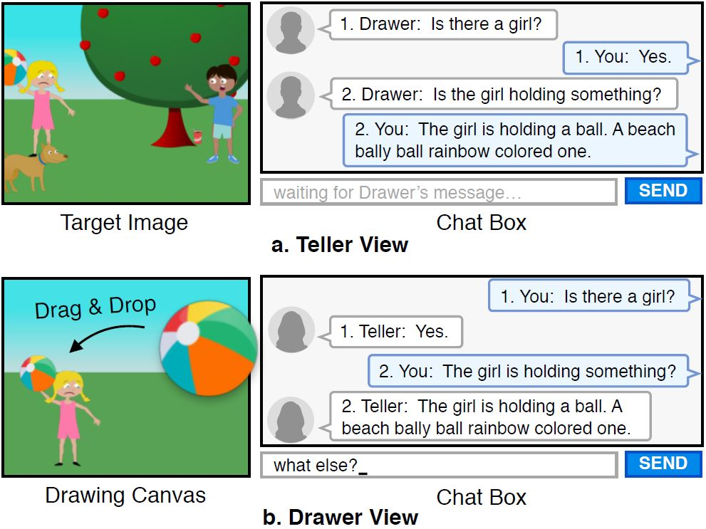

# CoDraw Dataset
Collaborative Drawing game (CoDraw) involves perception, communication, and actions in a partially observable virtual environment. Our game is grounded in a virtual world constructed by clip art objects [[Zitnick et al. (2013)](http://ieeexplore.ieee.org/document/6751319/) & [Zitnick and Parikh (2013)](https://www.cv-foundation.org/openaccess/content_cvpr_2013/papers/Zitnick_Bringing_Semantics_into_2013_CVPR_paper.pdf)], and a drag-and-drop interface based on the Visual Dialog chat interface [[Das et al. (2017)](https://visualdialog.org/)] as shown below:

<p align="center"></p>

Two players, **(a)** Teller and **(b)** Drawer, play the game. The Teller sees an abstract scene made from clip art objects, with a semantically meaningful configuration, while the Drawer sees a drawing canvas initialized with an empty canvas. Both players need to collaborate via natural language communication so that the Drawer can reconstruct the image of the Teller. 

### Peek Chance
While language-based communication is effective when exchanging high-level ideas, to get the details right, direct input of visual information could be constructive. For this, we give one chance for the Teller to peek at the Drawer's canvas using the `peek` button in the interface. Communication is only allowed after the peek window is closed.

## Download
* [CoDraw v1.0 (149MB)](https://drive.google.com/file/d/0B-u9nH58139bTy1XRFdqaVEzUGs/view?usp=sharing)

### Links
* [CoDraw Models](https://github.com/facebookresearch/codraw-models)
* [Abstract Scenes v1.1](https://vision.ece.vt.edu/clipart/)
* [VisDial AMT Chat](https://github.com/batra-mlp-lab/visdial-amt-chat)

## Reference

If you use this dataset as part of any published research, we'd really appreciate it if you could cite the following paper:
```
@article{CoDraw,
author = {Kim, Jin-Hwa and Kitaev, Nikita and Chen, Xinlei and Rohrbach, Marcus and Tian, Yuandong and Batra, Dhruv and Parikh, Devi},
journal = {arXiv preprint arXiv:1712.05558},
title = {{CoDraw: Collaborative Drawing as a Testbed for Grounded Goal-driven Communication}},
url = {http://arxiv.org/abs/1712.05558},
year = {2019}
}
```

### Run Visualizer

```
# git clone this repository

# download CoDraw_1_0.json to dataset/
# then fragment the big JSON file into mini JSON files based on dialog 
python script/preprocess.py dataset/CoDraw_1_0.json

# download abstract scene objects
ln -s directory_to_AbstractScenes_v1.1/Pngs Pngs

# run a simple HTTP server
python -m SimpleHTTPServer 9000
```

### Example

<p align="center"></p>

## JSON Format

The format of the dataset JSON file. In the list of `dialog`, teller's message are prior to drawer's message. If the dialog is started with drawer's message, the corresponding teller's message is empty. The `peeked: true` indicates the conversational round is occurred after peeking by Teller. Notice that the other conversational rounds does not have the key `peeked` instead of `peeked: false`.

```js
{ "count": 9993,
    "stat":{
        "<socketId>":{
            "start": [timestamp],
            "end": <timestap>,
            "duration": <second>,
            "round": <number>
        }
    },
    "data":{
        "<split>_05<imageId>":{
            "image_id": <imageId>,
            "abs_t": <abstractImgString>,
            "socketId": <socketId>,
            "dialog": [
                {
                    "seq_t": <tellerSequenceNumber>,
                    "seq_d": <drawerSequenceNumber>,
                    "msg_t": <tellerMessage>,
                    "msg_d": <drawerMessage>,
                    "abs_t": <groundTruthAbstractImgString>,
                    "abs_b": <beforeAbstractImgString>,
                    "abs_d": <drawerAbstractImgString>,
                    "peeked": <boolean>,
                    "score": [
                        <score>, 
                        [<weight1>, <weight2>, <weight3>, <weight4>, <weight5>, <weight6>, <weight7>], 
                        [<term1>, <term2>, <term3>, <term4>, <term5>, <term6>, <term7>], 
                        [<weighted1>, <weighted2>, <weighted3>, <weighted4>, <weighted5>, <weighted6>, <weighted7>]
                    ]
                }
                ...
            ]
        },
        ...
    }
}
```

### JSON Example

```js
{ "count": 9993,
    "stat":{
        "<socketId>":{
            "start": <timestamp>,
            "end": <timestap>,
            "duration": <second>,
            "round": <number>
        }
    },
    "data":{
        ...
        "train_00001":{
            "image_id": 1,
            "abs_t": "7,s_3s.png,0,3,0,469,31,2,0,p_7s.png,1,7,1,178,89,2,1,hb0_10s.png,2,10,2,100,250,1,0,hb1_4s.png,3,4,3,391,248,1,1,a_4s.png,4,4,4,205,98,1,0,c_7s.png,5,7,5,87,181,1,0,t_4s.png,6,4,7,279,115,1,1",
            "socketId": "/#MzjVHV80VmiPF6enAErY/#BlsI042k6IN2GQ8VAErX",
            "dialog": [
                ...
                {
                    "seq_t": 3,
                    "seq_d": 3,
                    "msg_t": "to the left is a worried woman running and to the right is an angry boy kicking a soccer ball at her.",
                    "msg_d": "ok",
                    "abs_t": "7,s_3s.png,0,3,0,469,31,2,0,p_7s.png,1,7,1,178,89,2,1,hb0_10s.png,2,10,2,100,250,1,0,hb1_4s.png,3,4,3,391,248,1,1,a_4s.png,4,4,4,205,98,1,0,c_7s.png,5,7,5,87,181,1,0,t_4s.png,6,4,7,279,115,1,1",
                    "abs_b": "28,s_3s.png,0,3,0,-10000,-10000,0,1,s_6s.png,1,6,0,-10000,-10000,0,0,s_1s.png,2,1,0,-10000,-10000,0,1,p_9s.png,3,9,1,445,150,1,1,p_8s.png,4,8,1,31,80,0,0,p_0s.png,5,0,1,-10000,-10000,0,1,p_1s.png,6,1,1,-10000,-10000,0,1,hb0_6s.png,7,6,2,-10000,-10000,0,1,hb0_5s.png,8,5,2,-10000,-10000,0,1,hb0_10s.png,9,10,2,-10000,-10000,0,0,hb0_33s.png,10,33,2,-10000,-10000,0,0,hb0_28s.png,11,28,2,-10000,-10000,0,0,hb1_29s.png,12,29,3,-10000,-10000,0,1,hb1_18s.png,13,18,3,-10000,-10000,0,0,hb1_11s.png,14,11,3,-10000,-10000,0,1,hb1_8s.png,15,8,3,-10000,-10000,0,0,hb1_21s.png,16,21,3,-10000,-10000,0,0,a_2s.png,17,2,4,-10000,-10000,0,1,a_3s.png,18,3,4,-10000,-10000,0,1,c_1s.png,19,1,5,-10000,-10000,0,1,c_8s.png,20,8,5,-10000,-10000,0,0,c_0s.png,21,0,5,-10000,-10000,0,0,e_6s.png,22,6,6,-10000,-10000,0,1,e_2s.png,23,2,6,-10000,-10000,0,0,t_4s.png,24,4,7,-10000,-10000,0,0,t_5s.png,25,5,7,-10000,-10000,0,1,t_10s.png,26,10,7,-10000,-10000,0,1,t_7s.png,27,7,7,-10000,-10000,0,1,",
                    "abs_d": "28,s_3s.png,0,3,0,-10000,-10000,0,1,s_6s.png,1,6,0,-10000,-10000,0,0,s_1s.png,2,1,0,-10000,-10000,0,1,p_9s.png,3,9,1,445,150,1,1,p_8s.png,4,8,1,31,80,0,0,p_0s.png,5,0,1,-10000,-10000,0,1,p_1s.png,6,1,1,-10000,-10000,0,1,hb0_6s.png,7,6,2,-10000,-10000,0,1,hb0_5s.png,8,5,2,-10000,-10000,0,1,hb0_10s.png,9,10,2,387,287,0,1,hb0_33s.png,10,33,2,-10000,-10000,0,0,hb0_28s.png,11,28,2,-10000,-10000,0,0,hb1_29s.png,12,29,3,-10000,-10000,0,1,hb1_18s.png,13,18,3,128,269,0,0,hb1_11s.png,14,11,3,-10000,-10000,0,1,hb1_8s.png,15,8,3,-10000,-10000,0,0,hb1_21s.png,16,21,3,-10000,-10000,0,0,a_2s.png,17,2,4,-10000,-10000,0,1,a_3s.png,18,3,4,-10000,-10000,0,1,c_1s.png,19,1,5,-10000,-10000,0,1,c_8s.png,20,8,5,-10000,-10000,0,0,c_0s.png,21,0,5,-10000,-10000,0,0,e_6s.png,22,6,6,-10000,-10000,0,1,e_2s.png,23,2,6,-10000,-10000,0,0,t_4s.png,24,4,7,248,273,0,0,t_5s.png,25,5,7,-10000,-10000,0,1,t_10s.png,26,10,7,-10000,-10000,0,1,t_7s.png,27,7,7,-10000,-10000,0,1,",
                    "score": [
                        4.100596866558356, 
                        [5, -1, -1, -1, -1, -0.5, -0.5], 
                        [0.8333333333333334, 0, 0, 0, 0.07928376012997321, 0, 0],
                        [4.166666666666667, 0, 0, 0, -0.06606980010831101, 0, 0]],
                }
                ...
            ]
        },
        ...
    }
}
```

## License
CoDraw is licensed under Creative Commons Attribution-NonCommercial 4.0 International Public License, as found in the LICENSE file.
